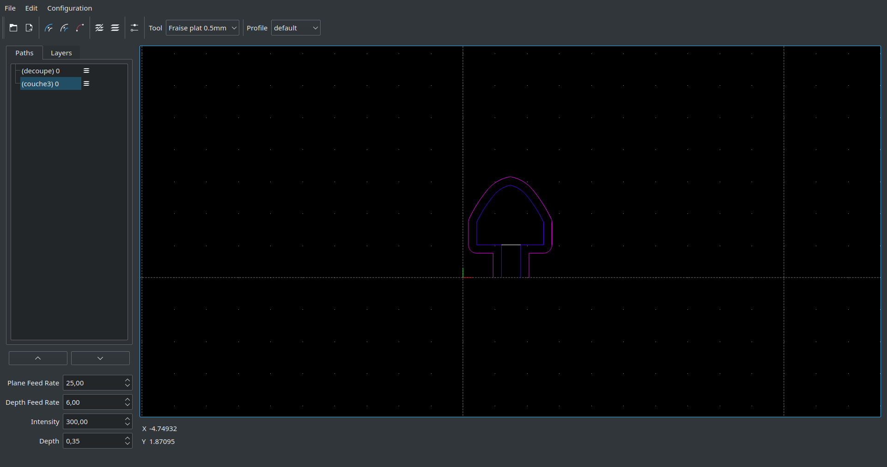
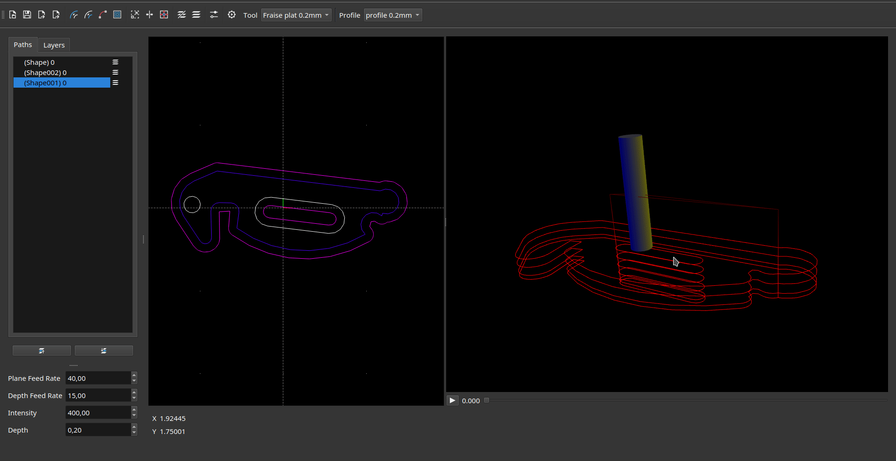
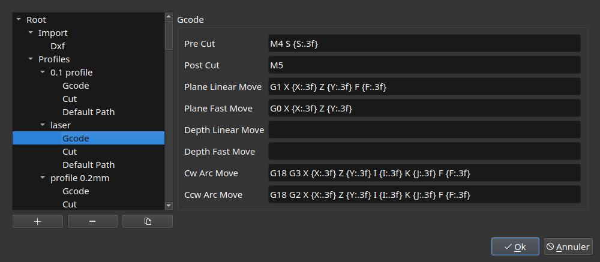

<p align="center">
	
</p>

# DXF Plotter

> Fast and easy to use DXF to GCode converter for laser and router CNC


[](https://github.com/panzergame/dxfplotter/actions)
[](https://sonarcloud.io/summary/new_code?id=dxfplotter)



This application helps users converting DXF files to GCode with minimal settings, fully configurable GCode commands format and fast spline to arc conversion. 

It targets only laser and router CNC following every lines and arcs from DXF file with optional desired depth.


## ⚙ Features

* DXF support of line, arc, circle, polyline, spline
* Customizable GCode command format
* Saving current work to file
* Multi selected path setting edition
* Path offseting (Tool Compensation)
* Pocket generation with islands capabilities
* Multi passes with depth
* Scale and translate paths
* 3D path simulation of the file

<p align="center">
	
</p>

<p align="center">
	
</p>

## Execution

Linux and Windows systems are supported.

### Running from exe (Windows)

Download latest , extract it and run `dxfplotter.exe`


### Running from AppImage (Linux)

Download latest  and run:

```sh
chmod +x dxfplotter-*.AppImage
./dxfplotter-*.AppImage
```

### 🏗 Manual installation from source (Linux)

This project depends on Qt5, for debian like distribution following command install all dependencies:

```sh
sudo apt-get install qtbase5-dev
```

```sh
git submodule init
git submodule update

cmake -B build
cmake --build build -j $(nproc)
```

## Usage example

Launch GUI

```sh
build$ ./dxfplotter
```

With a specified dxf file

```sh
build$ ./dxfplotter input.dxf
```

With a specified file and tool

```sh
build$ ./dxfplotter input.dxf -t "Mill 1mm"
```

Once opened, select path from left panel or from viewport and modify settings of selected path group or of single selected path. 

Export with `File->Export` or `Ctrl+E`

## ✏ Configuration



Configuration settings are exposed in `Configuration->Settings`, the configuration is splitted in two:
* general settings aiming dxf importing or default values
* tools with settings such as radius and gcode formatting

## 📝 GCode format

Simple set of GCode command is used per tool:


| Description | Default Command | Available Variables |
| - | - | - |
| Pre Cut | M4 S \{S:.3f} | S |
| Post Cut | M5 | |
| Plane Fast Move | G0 X \{X:.3f} Y \{Y:.3f} | X Y |
| Plane Linear Move | G1 X \{X:.3f} Y \{Y:.3f} F \{F:.3f} | F X Y |
| Depth Fast Move | G0 Z \{Z:.3f} | Z |
| Depth Linear Move | G1 Z \{Z:.3f} | F Z |
| CW Arc Move | G2 X \{X:.3f} Y \{Y:.3f} I \{I:.3f} J \{J:.3f} F \{F:.3f} | F X Y I J |
| CCW Arc Move | G3 X \{X:.3f} Y \{Y:.3f} I \{I:.3f} J \{J:.3f} F \{F:.3f} | F X Y I J |

They can be customized from tool Settings panel `Configuration->Settings->Tools->ToolName->Gcode` or from dxfplotter/config.yml file in your applications configuration folder.

Variables provided in formatting are available with {#:nf} where # is one of the supported variables and n the float precision: 

| Name | Description |
| - | - |
| S | Laser intensity |
| F | Movement feedrate |
| X | Movement X axis target |
| Y | Movement Y axis target |
| Z | Movement Z axis target |
| I | Relative arc center absciss |
| J | Relative arc center ordinate |

Properties `S` and `F` are exposed in path settings in UI.

## 3D simulation view

The following controls help you to navigate into the view:

| Keys | Action |
| - | - |
| Middle click | Rotate around view center |
| Middle click + Shift | Translate view center |
| Wheel | Zoom |


Ctrl key can be pressed to slow down motion.

## Author

👤 **Tristan Porteries**

* Github: [@panzergame](https://github.com/panzergame)

## 🤝 Contributing

Contributions, issues and feature requests are welcome!<br />Feel free to check [issues page](https://github.com/panzergame/dxfplotter/issues). 

## Show your support

Give a ⭐️ if this project helped you!

## 📝 License

Copyright © 2020 [Tristan Porteries](https://github.com/panzergame).<br />
This project is [MIT License](https://github.com/panzergame/dxfplotter/blob/master/LICENSE.md) licensed.
